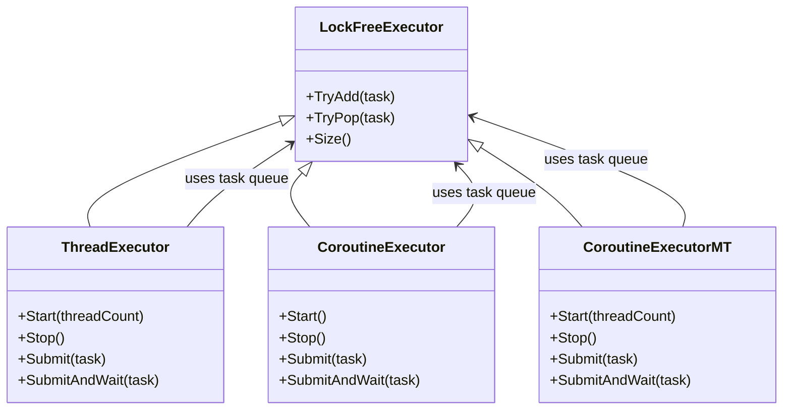
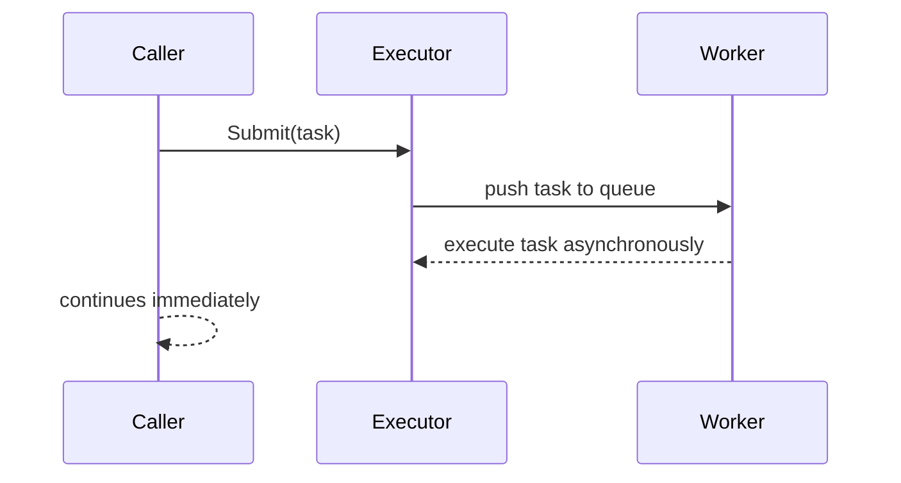
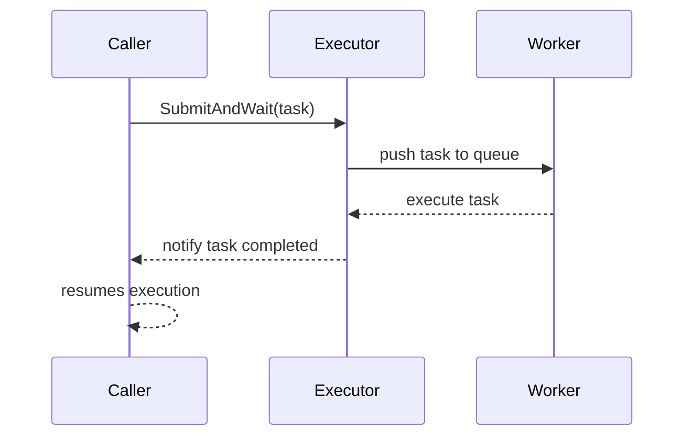

# Executor 模块

Executor 模块提供了一套统一的任务执行抽象，支持线程和协程两种执行方式，并提供 **Fire-and-Forget** 和 **阻塞等待** 两种任务提交模式。模块核心基于无锁队列实现，保证高性能任务调度。

---

## 特性

- **线程和协程支持**  
  - `ThreadExecutor`：基于线程的任务执行器  
  - `CoroutineExecutor`：单线程多协程执行器  
  - `CoroutineExecutorMT`：多线程多协程执行器
- **任务队列无锁实现**：`LockFreeExecutor` 提供核心任务队列
- **任务提交方式**：
  - `Submit(task)`：Fire-and-Forget
  - `SubmitAndWait(task)`：阻塞等待任务执行结果
- **轻量级、高性能**，适用于高并发场景

---

## 类关系图



---

## 调用流程图

### Fire-and-Forget



### 阻塞等待 SubmitAndWait



---

## 使用示例

```cpp
#include "ThreadExecutor.h"
#include "CoroutineExecutor.h"
#include "CoroutineExecutorMT.h"

void ExampleTask(int value) {
    std::cout << "Task executed: " << value << std::endl;
}

int main() {
    // ThreadExecutor
    ThreadExecutor exec([](int v){ ExampleTask(v); }, 2);
    exec.Start();
    exec.Submit(42);
    exec.SubmitAndWait(100);
    exec.Stop();

    // CoroutineExecutor
    CoroutineExecutor coExec([](int v){ ExampleTask(v); });
    coExec.Start();
    coExec.Submit(55);
    coExec.SubmitAndWait(77);
    coExec.Stop();

    // CoroutineExecutorMT
    CoroutineExecutorMT coExecMT([](int v){ ExampleTask(v); }, 4);
    coExecMT.Start();
    coExecMT.Submit(88);
    coExecMT.SubmitAndWait(99);
    coExecMT.Stop();

    return 0;
}
```

---

## 架构说明

1. **LockFreeExecutor**  
   提供无锁队列的基础操作 `TryAdd`、`TryPop`，可在多线程和多协程环境中安全使用。

2. **ThreadExecutor / CoroutineExecutor / CoroutineExecutorMT**  
   在 `LockFreeExecutor` 之上实现具体执行策略：
   - **线程执行器**：直接启动线程消费任务队列
   - **协程执行器**：单线程管理多个协程处理队列
   - **多线程多协程执行器**：多线程 + 多协程混合调度

3. **任务提交模式**：
   - `Submit(task)`：提交任务后立即返回，不阻塞调用者
   - `SubmitAndWait(task)`：提交任务并阻塞调用者直到任务执行完成

4. **策略层（Retry / Timeout / Backoff）**  
   - Executor 核心只提供任务队列和执行调度
   - 外层 Runtime 可以组合策略实现重试、超时或批量处理

---

## 注意事项

- Executor 内部队列是无锁的，但阻塞和等待机制仍然需要小心使用，避免死锁
- CoroutineExecutor 默认单线程执行，适合 IO 密集型任务
- CoroutineExecutorMT 适合 CPU 密集 + 高并发场景
- Fire-and-Forget 不保证任务完成顺序
- SubmitAndWait 会阻塞调用者直到任务执行完成

---

## 作者

BUG

## 日期

2025-12-26
